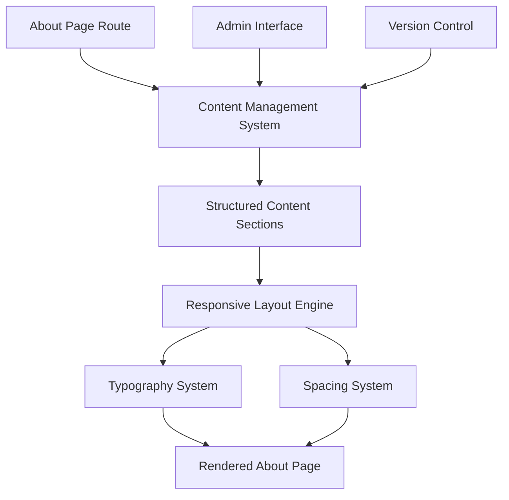

# Design Document: WIPP About Page Redesign

## Overview

The WIPP About page redesign creates a calm, authentic introduction to the platform that builds trust with artists through honest communication and thoughtful design. Unlike typical startup About pages that focus on growth metrics and corporate messaging, this design prioritizes emotional connection and clear value communication.

The page serves as both an introduction to WIPP's philosophy and a filtering mechanism, helping artists self-select based on their values around feedback, community, and creative growth. The design emphasizes readability, authenticity, and the platform's core differentiator: being a space for unfinished work and structured critique.

## Architecture

### Content Architecture

The About page follows a narrative arc that mirrors an artist's journey from creative doubt to finding community:

1. **Emotional Hook** - Validates common artist experiences
2. **Platform Definition** - Explains what WIPP is in accessible terms  
3. **Problem Context** - Articulates why WIPP exists and what it solves
4. **Functional Overview** - Describes how the platform works
5. **Boundary Setting** - Clarifies what WIPP is not
6. **Audience Identification** - Helps visitors determine fit
7. **Authentic Invitation** - Provides non-pressured next steps

### Technical Architecture



The page uses a component-based architecture where each content section is independently manageable while maintaining visual consistency through shared design systems.

## Components and Interfaces

### Core Components

**AboutPageSection**
- Handles individual content sections with consistent spacing
- Supports flexible content types (text, lists, quotes)
- Maintains typography hierarchy
- Ensures responsive behavior

**ContentManager**
- Provides CRUD operations for About page content
- Maintains content versioning
- Supports structured editing with preview
- Handles content validation and formatting

**TypographySystem**
- Enforces consistent text styling across sections
- Implements calm, readable typography choices
- Supports accessibility requirements
- Manages responsive text scaling

### Content Structure Interface

```typescript
interface AboutPageContent {
  sections: {
    quietOpening: ContentSection;
    platformDefinition: ContentSection;
    problemContext: ContentSection;
    functionalOverview: ContentSection;
    boundarySettings: ContentSection;
    audienceIdentification: ContentSection;
    authenticInvitation: ContentSection;
  };
  metadata: {
    lastUpdated: Date;
    version: string;
    author: string;
  };
}

interface ContentSection {
  title?: string;
  paragraphs: string[];
  lists?: string[];
  emphasis?: string[];
}
```

## Data Models

### Content Management

**AboutPageContent Model**
- Structured storage for all page sections
- Version tracking for content changes
- Metadata for administrative purposes
- Validation rules for content quality

**ContentVersion Model**
- Historical tracking of page changes
- Rollback capabilities for content
- Change attribution and timestamps
- Diff tracking for content evolution

### User Interaction Tracking

**PageAnalytics Model** (Optional)
- Basic engagement metrics (time on page, scroll depth)
- Section-level interaction tracking
- Conversion funnel analysis (About → Signup)
- Privacy-compliant data collection

## Design Principles

### Visual Design

**Calm Aesthetics**
- Generous white space between sections (minimum 3rem)
- Muted color palette focusing on readability
- Typography that feels handwritten rather than corporate
- Minimal visual elements that don't compete with content

**Typography Hierarchy**
- Large, readable body text (18-20px minimum)
- Short paragraphs (2-4 sentences maximum)
- Clear section breaks without heavy visual dividers
- Consistent line height for comfortable reading

**Responsive Behavior**
- Mobile-first approach with generous touch targets
- Readable text at all screen sizes
- Maintained white space proportions across devices
- Accessible navigation and interaction patterns

### Content Strategy

**Tone and Voice**
- Written from artist perspective, not founder perspective
- Acknowledges creative struggles without being dramatic
- Uses "we" language to build community feeling
- Avoids startup buzzwords and growth-focused language

**Trust Building Elements**
- Honest acknowledgment of platform limitations
- Clear explanation of what WIPP is NOT
- Transparent communication about community values
- Authentic invitation without sales pressure

## Error Handling

### Content Management Errors

**Validation Failures**
- Content length limits to maintain readability
- Tone analysis to flag corporate language
- Link validation for external references
- Image optimization and accessibility checks

**System Failures**
- Graceful degradation when content management is unavailable
- Cached content serving during system maintenance
- Error logging for content update failures
- Rollback procedures for problematic content changes

### User Experience Errors

**Loading Issues**
- Progressive content loading for slow connections
- Skeleton screens during content fetch
- Offline content caching for return visitors
- Clear error messages for connection problems

## Testing Strategy

The About page requires both traditional testing approaches and specialized content validation to ensure it achieves its trust-building and filtering objectives.

### Unit Testing Approach

Unit tests focus on component behavior, content validation, and accessibility compliance:

- **Content Management**: Test CRUD operations, validation rules, and version control
- **Component Rendering**: Verify proper typography, spacing, and responsive behavior  
- **Accessibility**: Validate WCAG compliance, keyboard navigation, and screen reader compatibility
- **Performance**: Test loading times, image optimization, and caching behavior

### Property-Based Testing Approach

Property-based tests validate universal behaviors across different content variations and user scenarios. Each test runs a minimum of 100 iterations to ensure comprehensive coverage.

Tests use a property-based testing library appropriate for the implementation language, with each test tagged to reference its corresponding design property.

## Correctness Properties

*A property is a characteristic or behavior that should hold true across all valid executions of a system—essentially, a formal statement about what the system should do. Properties serve as the bridge between human-readable specifications and machine-verifiable correctness guarantees.*

### Property 1: Content formatting consistency
*For any* About page content, all paragraphs should be under 200 words and have minimum 2rem spacing between sections to maintain calm readability
**Validates: Requirements 1.3, 8.1**

### Property 2: Content validation rules
*For any* About page content update, the system should reject content containing startup buzzwords, sales-focused CTAs, emojis, or corporate design elements
**Validates: Requirements 2.4, 7.3, 8.3**

### Property 3: Content management system operations
*For any* content section in the About page, the content management system should allow editing while preserving structured format and maintaining version history
**Validates: Requirements 9.1, 9.2, 9.4**

### Property 4: Visual consistency preservation
*For any* content update operation, the system should maintain consistent CSS styling and visual hierarchy across all page sections
**Validates: Requirements 9.3**