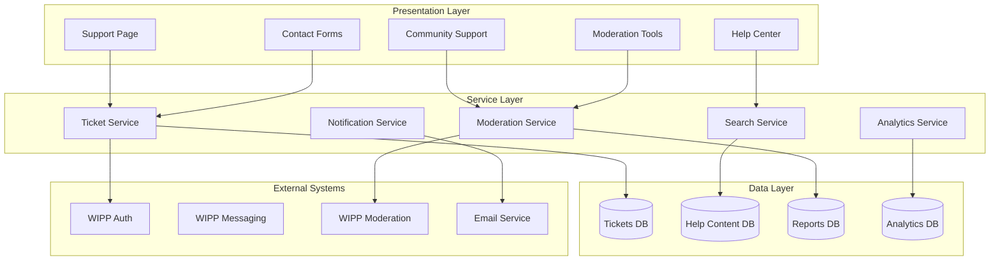

# Design Document: Artist Support System

## Overview

The Artist Support System transforms WIPP's placeholder support page into a comprehensive, multi-channel support ecosystem that maintains the platform's philosophy of genuine, supportive interactions. The system provides artists with multiple pathways to get help while ensuring Support_Agents have the tools needed to provide effective assistance.

The design emphasizes self-service capabilities through a robust help center, while providing escalation paths for complex issues. The system integrates seamlessly with WIPP's existing authentication, messaging, and moderation infrastructure.

## Architecture

The Artist Support System follows a layered architecture with clear separation of concerns:



### Key Architectural Principles

1. **Integration-First**: Leverages existing WIPP infrastructure rather than duplicating functionality
2. **Progressive Disclosure**: Guides users from self-service to human assistance as needed
3. **Scalable Moderation**: Supports both automated and human moderation workflows
4. **Privacy-Aware**: Respects WIPP's encryption and privacy features
5. **Mobile-Responsive**: Consistent experience across all device types

## Components and Interfaces

### Support Page Controller
**Purpose**: Main entry point that orchestrates the support experience
**Key Methods**:
- `renderSupportPage()`: Displays the main support interface with all available channels
- `routeToChannel(channelType)`: Directs users to appropriate support channels
- `trackUserJourney()`: Records analytics for support flow optimization

### Help Center Service
**Purpose**: Manages searchable documentation and self-service resources
**Key Methods**:
- `searchContent(query, filters)`: Returns relevant help articles and tutorials
- `getCategoryContent(category)`: Retrieves organized content by topic
- `trackContentUsage(articleId, userId)`: Records article views for analytics
- `suggestRelatedContent(articleId)`: Provides content recommendations

### Ticket Management Service
**Purpose**: Handles support ticket lifecycle from creation to resolution
**Key Methods**:
- `createTicket(userId, category, description, attachments)`: Creates new support tickets
- `assignTicket(ticketId, agentId)`: Routes tickets to appropriate support agents
- `updateTicketStatus(ticketId, status, response)`: Manages ticket state changes
- `getTicketHistory(ticketId)`: Retrieves complete ticket interaction history

### Community Support Service
**Purpose**: Facilitates peer-to-peer assistance and community-driven help
**Key Methods**:
- `createDiscussion(userId, topic, content)`: Starts new community discussions
- `moderateContent(contentId, action)`: Applies community moderation rules
- `highlightHelpfulResponses(responseId)`: Promotes quality community contributions
- `generateCommunityInsights()`: Analyzes community support patterns

### Moderation Dashboard Service
**Purpose**: Provides tools for Support_Agents to manage reports and community safety
**Key Methods**:
- `getReportQueue(filters)`: Retrieves pending moderation reports
- `processReport(reportId, action, notes)`: Takes action on reported content
- `generateModerationReport()`: Creates analytics on moderation activity
- `escalateToAdmin(reportId, reason)`: Escalates serious issues to administrators

### Resource Library Service
**Purpose**: Manages educational content and artist development resources
**Key Methods**:
- `organizeBySkillLevel(content)`: Categorizes resources by difficulty
- `curateContent(criteria)`: Selects and highlights quality resources
- `trackResourceUsage(resourceId, userId)`: Monitors resource engagement
- `acceptCommunityContributions(submission)`: Processes user-submitted resources

## Data Models

### Support Ticket Model
```typescript
interface SupportTicket {
  id: string;
  userId: string;
  category: TicketCategory;
  priority: Priority;
  status: TicketStatus;
  subject: string;
  description: string;
  attachments: Attachment[];
  assignedAgentId?: string;
  createdAt: Date;
  updatedAt: Date;
  responses: TicketResponse[];
  metadata: TicketMetadata;
}

enum TicketCategory {
  ACCOUNT_ISSUES = 'account_issues',
  TECHNICAL_SUPPORT = 'technical_support',
  COMMUNITY_GUIDELINES = 'community_guidelines',
  FEATURE_REQUEST = 'feature_request',
  SAFETY_CONCERN = 'safety_concern',
  OTHER = 'other'
}

enum Priority {
  LOW = 'low',
  MEDIUM = 'medium',
  HIGH = 'high',
  EMERGENCY = 'emergency'
}

enum TicketStatus {
  OPEN = 'open',
  IN_PROGRESS = 'in_progress',
  WAITING_FOR_USER = 'waiting_for_user',
  RESOLVED = 'resolved',
  CLOSED = 'closed'
}
```

### Help Article Model
```typescript
interface HelpArticle {
  id: string;
  title: string;
  content: string;
  category: string;
  tags: string[];
  difficulty: SkillLevel;
  lastUpdated: Date;
  authorId: string;
  viewCount: number;
  helpfulVotes: number;
  searchKeywords: string[];
  relatedArticles: string[];
}

enum SkillLevel {
  BEGINNER = 'beginner',
  INTERMEDIATE = 'intermediate',
  ADVANCED = 'advanced'
}
```

### Community Discussion Model
```typescript
interface CommunityDiscussion {
  id: string;
  authorId: string;
  title: string;
  content: string;
  category: string;
  tags: string[];
  status: DiscussionStatus;
  responses: CommunityResponse[];
  helpfulResponseIds: string[];
  moderationFlags: ModerationFlag[];
  createdAt: Date;
  lastActivity: Date;
}

interface CommunityResponse {
  id: string;
  authorId: string;
  content: string;
  isHelpful: boolean;
  helpfulVotes: number;
  moderationStatus: ModerationStatus;
  createdAt: Date;
}
```

### Support Analytics Model
```typescript
interface SupportAnalytics {
  id: string;
  period: AnalyticsPeriod;
  ticketVolume: number;
  averageResponseTime: number;
  resolutionRate: number;
  categoryBreakdown: CategoryStats[];
  userSatisfactionScore: number;
  helpCenterUsage: ContentUsageStats[];
  communityActivity: CommunityStats;
  generatedAt: Date;
}
```

## Correctness Properties

*A property is a characteristic or behavior that should hold true across all valid executions of a system—essentially, a formal statement about what the system should do. Properties serve as the bridge between human-readable specifications and machine-verifiable correctness guarantees.*

### Property 1: System Responsiveness and Performance
*For any* user interaction with the support system (search queries, ticket submissions, report acknowledgments), the system should respond within specified time limits (2 seconds for search, 5 minutes for email confirmations, 1 hour for report acknowledgments)
**Validates: Requirements 2.2, 3.2, 5.3**

### Property 2: Unique Identifier Generation
*For any* support ticket or report submission, the system should generate a globally unique identifier that can be used for tracking and reference throughout the ticket lifecycle
**Validates: Requirements 3.1**

### Property 3: Emergency Prioritization and Routing
*For any* support request marked as emergency or safety-critical, the system should bypass normal processing queues, flag for immediate attention, and maintain the 24-hour response commitment
**Validates: Requirements 8.2, 8.4, 8.5**

### Property 4: Platform Integration Consistency
*For any* support system interaction, user authentication, profile data, privacy settings, and notification preferences should remain consistent with the main WIPP platform
**Validates: Requirements 7.1, 7.2, 7.3, 7.6, 7.7**

### Property 5: Content Organization and Categorization
*For any* content in the help center, resource library, or community discussions, it should be properly categorized, tagged with appropriate metadata, and organized by relevant criteria (skill level, topic, platform feature)
**Validates: Requirements 2.1, 2.7, 4.2, 9.6**

### Property 6: Notification Delivery Reliability
*For any* system event requiring user notification (ticket confirmations, agent responses, guideline updates), the appropriate notification should be delivered through the user's preferred channels within specified timeframes
**Validates: Requirements 3.2, 3.6, 5.7, 7.6**

### Property 7: Moderation Action Logging and Consistency
*For any* moderation action taken on reports, community content, or support interactions, the action should be logged with complete audit trail, applied consistently according to platform guidelines, and generate appropriate analytics data
**Validates: Requirements 6.3, 6.6, 9.4**

### Property 8: File Attachment and Content Handling
*For any* file attachment or content submission in support tickets or community discussions, the system should validate file types and sizes, store securely, and maintain accessibility for authorized users
**Validates: Requirements 3.4**

### Property 9: Community Engagement and Reputation Tracking
*For any* community support interaction (helpful response marking, reputation scoring, duplicate prevention), the system should accurately track engagement metrics and maintain fair reputation systems
**Validates: Requirements 9.2, 9.3, 9.7**

### Property 10: Analytics and Insights Generation
*For any* support system activity (ticket volume, resolution rates, user satisfaction, help center usage), the system should collect accurate metrics and generate actionable insights for system improvement
**Validates: Requirements 10.1, 10.2, 10.3, 10.4, 10.5, 10.6, 10.7**

## Error Handling

### Ticket System Error Handling
- **Database Connection Failures**: Implement retry logic with exponential backoff, queue tickets locally if database unavailable
- **Email Service Failures**: Store confirmation emails in retry queue, provide in-app notification as fallback
- **File Upload Errors**: Validate file types and sizes client-side, provide clear error messages for rejected uploads
- **Authentication Failures**: Gracefully redirect to login, preserve form data for post-authentication completion

### Search Service Error Handling
- **Search Index Unavailable**: Fall back to database queries with performance warnings
- **Query Parsing Errors**: Sanitize queries, provide suggested corrections for malformed searches
- **Content Retrieval Failures**: Display cached versions when available, show graceful degradation messages

### Moderation System Error Handling
- **Report Processing Failures**: Queue reports for manual review, notify administrators of system issues
- **Escalation Failures**: Maintain local escalation queue, provide alternative contact methods
- **Analytics Collection Failures**: Continue core functionality, log analytics failures for later processing

## Testing Strategy

The Artist Support System requires comprehensive testing to ensure reliability and user satisfaction across all support channels.

### Unit Testing Approach
Unit tests focus on individual component behavior and edge cases:
- **Ticket Management**: Test ticket creation, status transitions, and assignment logic
- **Search Functionality**: Verify query parsing, result ranking, and content filtering
- **Moderation Logic**: Test report categorization, priority calculation, and escalation rules
- **Integration Points**: Mock external services to test error handling and fallback behavior

### Property-Based Testing Configuration
Property-based tests validate universal behaviors across all inputs using **fast-check** for TypeScript:
- **Minimum 100 iterations** per property test to ensure comprehensive input coverage
- **Custom generators** for creating realistic support tickets, help articles, and user interactions
- **Shrinking strategies** to identify minimal failing cases when properties are violated

Each property test references its corresponding design property:
- **Tag format**: `Feature: artist-support-system, Property {number}: {property_text}`
- **Test isolation**: Each property runs independently with fresh test data
- **Performance monitoring**: Track test execution time to identify performance regressions

### Integration Testing Strategy
Integration tests verify component interactions and external service integration:
- **Database Integration**: Test ticket persistence, search indexing, and analytics collection
- **Email Service Integration**: Verify confirmation emails, notification delivery, and retry logic
- **WIPP Platform Integration**: Test authentication flow, user data synchronization, and privacy compliance
- **End-to-End Workflows**: Validate complete user journeys from problem identification to resolution

The dual testing approach ensures both specific edge cases are handled correctly (unit tests) and universal properties hold across all possible inputs (property tests), providing comprehensive coverage for the support system's critical functionality.