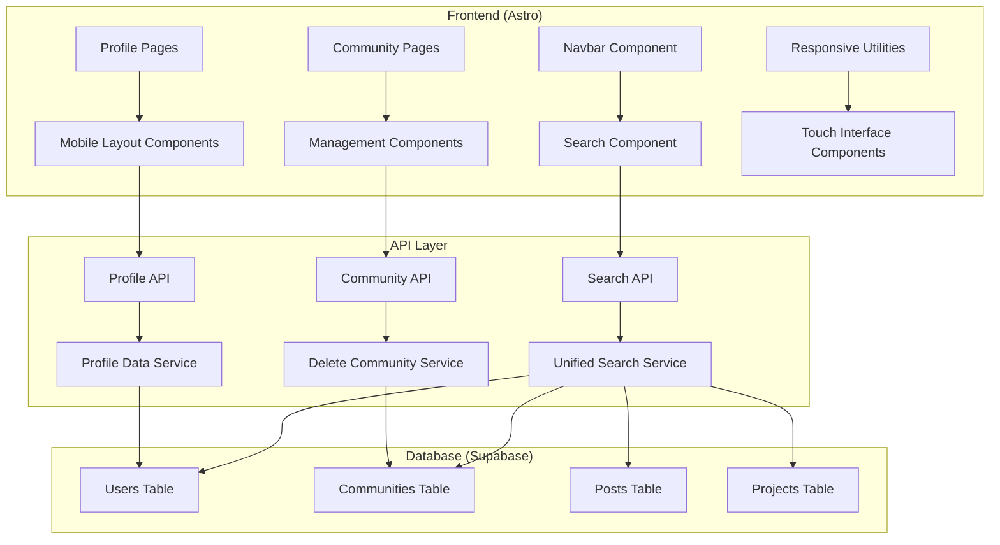

# Design Document: Mobile Optimization and UI Improvements

## Overview

This design implements comprehensive mobile optimization and UI improvements for an Astro-based web application. The solution addresses search functionality enhancement, mobile responsiveness issues, profile page fixes, community management improvements, and touch interface optimization.

The design follows a component-based approach, leveraging Astro's existing architecture while introducing new responsive components and API endpoints. The implementation prioritizes mobile-first design principles and maintains backward compatibility with existing desktop functionality.

## Architecture

### High-Level Architecture



### Component Architecture

The design introduces several new components and modifies existing ones:

1. **Enhanced Navbar Component**: Integrates unified search functionality
2. **Responsive Layout Components**: Provide mobile-optimized layouts
3. **Profile Card Components**: Display user information with proper mobile formatting
4. **Community Management Components**: Handle community administration
5. **Touch Interface Utilities**: Ensure proper touch target sizing

## Components and Interfaces

### Search System

#### UnifiedSearch Component
```typescript
interface SearchResult {
  id: string;
  type: 'user' | 'community' | 'post' | 'project';
  title: string;
  description?: string;
  url: string;
  metadata?: Record<string, any>;
}

interface SearchResponse {
  results: SearchResult[];
  totalCount: number;
  searchTime: number;
}

interface SearchProps {
  placeholder?: string;
  maxResults?: number;
  onResultSelect?: (result: SearchResult) => void;
}
```

#### Search API Endpoint
```typescript
// /api/search/unified.ts
interface SearchRequest {
  query: string;
  types?: ('user' | 'community' | 'post' | 'project')[];
  limit?: number;
}
```

### Mobile Layout System

#### ResponsiveContainer Component
```typescript
interface ResponsiveContainerProps {
  maxWidth?: 'sm' | 'md' | 'lg' | 'xl';
  padding?: 'none' | 'sm' | 'md' | 'lg';
  children: React.ReactNode;
}
```

#### MobileNavigation Component
```typescript
interface MobileNavigationProps {
  isOpen: boolean;
  onToggle: () => void;
  menuItems: NavigationItem[];
}

interface NavigationItem {
  label: string;
  href: string;
  icon?: string;
  isActive?: boolean;
}
```

### Profile System

#### ProfileCard Component
```typescript
interface ProfileCardProps {
  user: UserProfile;
  showAboutMe?: boolean;
  showWebsite?: boolean;
  isMobile?: boolean;
}

interface UserProfile {
  id: string;
  username: string;
  displayName: string;
  bio?: string;
  website?: string;
  avatarUrl?: string;
  bannerUrl?: string;
  aboutMe?: string;
}
```

### Community Management

#### CommunityActions Component
```typescript
interface CommunityActionsProps {
  community: Community;
  userRole: 'owner' | 'admin' | 'member' | 'visitor';
  onDelete?: (communityId: string) => void;
}

interface Community {
  id: string;
  name: string;
  description: string;
  ownerId: string;
  adminIds: string[];
  memberCount: number;
}
```

## Data Models

### Enhanced User Model
```typescript
interface User {
  id: string;
  username: string;
  email: string;
  displayName: string;
  bio?: string;
  website?: string;
  aboutMe?: string;
  avatarUrl?: string;
  bannerUrl?: string;
  createdAt: Date;
  updatedAt: Date;
}
```

### Search Index Model
```typescript
interface SearchIndex {
  id: string;
  contentType: 'user' | 'community' | 'post' | 'project';
  contentId: string;
  title: string;
  description: string;
  searchableText: string;
  metadata: Record<string, any>;
  createdAt: Date;
  updatedAt: Date;
}
```

### Responsive Breakpoints
```typescript
interface BreakpointConfig {
  xs: number; // 0px
  sm: number; // 640px
  md: number; // 768px
  lg: number; // 1024px
  xl: number; // 1280px
  xxl: number; // 1536px
}

const BREAKPOINTS: BreakpointConfig = {
  xs: 0,
  sm: 640,
  md: 768,
  lg: 1024,
  xl: 1280,
  xxl: 1536
};
```

### Touch Interface Standards
```typescript
interface TouchTargetConfig {
  minSize: number; // 44px minimum
  spacing: number; // 8px minimum between targets
  tapHighlight: string; // CSS color for touch feedback
}

const TOUCH_STANDARDS: TouchTargetConfig = {
  minSize: 44,
  spacing: 8,
  tapHighlight: 'rgba(0, 0, 0, 0.1)'
};
```

## Correctness Properties

*A property is a characteristic or behavior that should hold true across all valid executions of a system-essentially, a formal statement about what the system should do. Properties serve as the bridge between human-readable specifications and machine-verifiable correctness guarantees.*

### Property Reflection

After analyzing all acceptance criteria, I identified several areas where properties can be consolidated:

- Properties 2.1, 2.2, 2.3, 2.4, and 2.5 all relate to mobile responsiveness and can be combined into comprehensive mobile layout properties
- Properties 5.1, 5.2, 5.3, 5.4, and 5.5 all relate to touch interface standards and can be consolidated
- Properties 3.1, 3.4, and 3.5 relate to profile layout quality and can be combined
- Properties 4.2 and 4.5 both relate to role-based access control and can be unified

### Search System Properties

**Property 1: Unified search coverage**
*For any* search query, when matching content exists across users, communities, posts, and projects, the search results should include matches from all applicable content types
**Validates: Requirements 1.1**

**Property 2: Search result organization**
*For any* search results returned, they should be properly categorized by content type and formatted with consistent structure including title, description, and navigation URL
**Validates: Requirements 1.2**

**Property 3: Search result navigation**
*For any* search result selected, the navigation URL should correspond to the correct page type for that content (user profiles for users, community pages for communities, etc.)
**Validates: Requirements 1.3**

### Mobile Responsiveness Properties

**Property 4: Mobile viewport compliance**
*For any* page content rendered on mobile breakpoints (below 768px), all content containers should fit within the viewport width without causing horizontal scrolling
**Validates: Requirements 2.1, 2.2**

**Property 5: Mobile content scaling**
*For any* images and media content displayed on mobile devices, they should have appropriate CSS properties (max-width: 100%, height: auto) to scale within viewport constraints
**Validates: Requirements 2.3**

**Property 6: Mobile typography standards**
*For any* text content displayed on mobile breakpoints, font sizes should be at least 16px and line heights should be at least 1.4 for optimal readability
**Validates: Requirements 2.4**

### Profile System Properties

**Property 7: Profile name visibility**
*For any* user profile page, the display name element should not overlap with banner image elements and should maintain readable contrast
**Validates: Requirements 3.1, 3.5**

**Property 8: Profile field display**
*For any* user profile with populated website or aboutMe fields, these fields should be rendered visibly on the profile page with appropriate formatting
**Validates: Requirements 3.2, 3.3**

**Property 9: Mobile profile layout**
*For any* profile page viewed on mobile devices, all profile elements should maintain minimum 16px spacing and proper text contrast
**Validates: Requirements 3.4**

### Community Management Properties

**Property 10: Community management access control**
*For any* community page viewed by a user, management options (including delete functionality) should only be displayed if the user has owner or admin role for that community
**Validates: Requirements 4.2, 4.5**

**Property 11: Community deletion confirmation**
*For any* community deletion action initiated, a confirmation dialog should be displayed before executing the deletion operation
**Validates: Requirements 4.3**

**Property 12: Community deletion cleanup**
*For any* community successfully deleted, all associated database records should be removed and the user should be redirected to an appropriate page
**Validates: Requirements 4.4**

### Touch Interface Properties

**Property 13: Touch target sizing**
*For any* interactive element displayed on mobile devices, the touch target should be at least 44px in both width and height
**Validates: Requirements 5.1, 5.3, 5.4**

**Property 14: Touch target spacing**
*For any* adjacent interactive elements on mobile devices, there should be at least 8px spacing between their touch targets
**Validates: Requirements 5.2**

**Property 15: Touch feedback provision**
*For any* interactive element on mobile devices, touch interactions should provide visual feedback through CSS transitions or state changes
**Validates: Requirements 5.5**

### Data Integration Properties

**Property 16: Search database coverage**
*For any* search query executed, the database queries should include all relevant content tables (users, communities, posts, projects) and return properly structured results
**Validates: Requirements 6.1**

**Property 17: Database operation integrity**
*For any* database operation (community deletion, profile updates), the operation should maintain referential integrity and complete successfully or roll back completely
**Validates: Requirements 6.2, 6.3, 6.5**

**Property 18: API error handling**
*For any* API call that encounters an error, the system should catch the error and return a user-friendly error message without exposing internal details
**Validates: Requirements 6.4**

## Error Handling

### Search System Error Handling

1. **Empty Query Handling**: Display helpful message when search query is empty or too short
2. **No Results Handling**: Show alternative suggestions when no matches are found
3. **Search Timeout**: Implement timeout handling for slow database queries
4. **Malformed Query**: Sanitize and validate search input to prevent injection attacks

### Mobile Layout Error Handling

1. **Viewport Detection**: Gracefully handle cases where viewport detection fails
2. **Image Loading**: Provide fallback behavior for failed image loads on mobile
3. **Breakpoint Failures**: Ensure layouts remain functional if CSS breakpoints fail to load

### Profile System Error Handling

1. **Missing Profile Data**: Handle cases where user profiles have incomplete information
2. **Banner Image Failures**: Provide fallback styling when banner images fail to load
3. **Text Overflow**: Implement text truncation for very long profile content

### Community Management Error Handling

1. **Permission Validation**: Verify user permissions before showing management options
2. **Deletion Failures**: Handle database errors during community deletion gracefully
3. **Confirmation Bypass**: Prevent accidental deletions if confirmation dialogs fail

### Touch Interface Error Handling

1. **Touch Detection**: Provide fallback behavior for devices with poor touch detection
2. **Size Calculation**: Handle cases where element size calculation fails
3. **Feedback Failures**: Ensure basic functionality remains if touch feedback fails

## Testing Strategy

### Dual Testing Approach

This feature requires both unit testing and property-based testing for comprehensive coverage:

**Unit Tests** focus on:
- Specific examples of search queries and expected results
- Edge cases like empty search results and malformed queries
- Integration points between components and APIs
- Error conditions and boundary cases
- Specific mobile breakpoint behaviors

**Property Tests** focus on:
- Universal properties that hold across all search inputs
- Mobile responsiveness across all viewport sizes
- Touch interface compliance across all interactive elements
- Profile layout correctness across all user data variations
- Database integrity across all operations

### Property-Based Testing Configuration

- **Testing Library**: Use `@fast-check/vitest` for TypeScript/JavaScript property-based testing
- **Test Iterations**: Minimum 100 iterations per property test
- **Test Tagging**: Each property test must reference its design document property
- **Tag Format**: `// Feature: mobile-optimization-ui-improvements, Property {number}: {property_text}`

### Testing Coverage Areas

1. **Search Functionality Testing**
   - Property tests for search result completeness and organization
   - Unit tests for specific search scenarios and edge cases
   - Integration tests for API endpoint behavior

2. **Mobile Responsiveness Testing**
   - Property tests for viewport compliance across all screen sizes
   - Unit tests for specific breakpoint behaviors
   - Visual regression tests for layout consistency

3. **Profile System Testing**
   - Property tests for profile field display logic
   - Unit tests for specific profile configurations
   - Layout tests for name visibility and spacing

4. **Community Management Testing**
   - Property tests for role-based access control
   - Unit tests for deletion workflow steps
   - Integration tests for database cleanup

5. **Touch Interface Testing**
   - Property tests for touch target sizing compliance
   - Unit tests for specific touch interaction scenarios
   - Accessibility tests for touch interface standards

### Test Environment Configuration

- **Mobile Testing**: Use viewport simulation for mobile breakpoint testing
- **Database Testing**: Use Supabase test database with proper cleanup
- **API Testing**: Mock external dependencies while testing core logic
- **Performance Testing**: Monitor search response times and mobile rendering performance